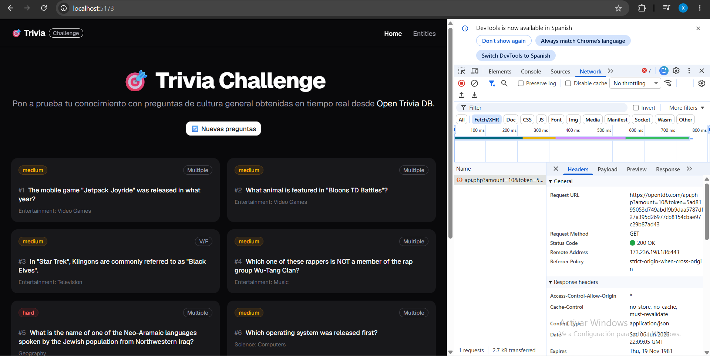
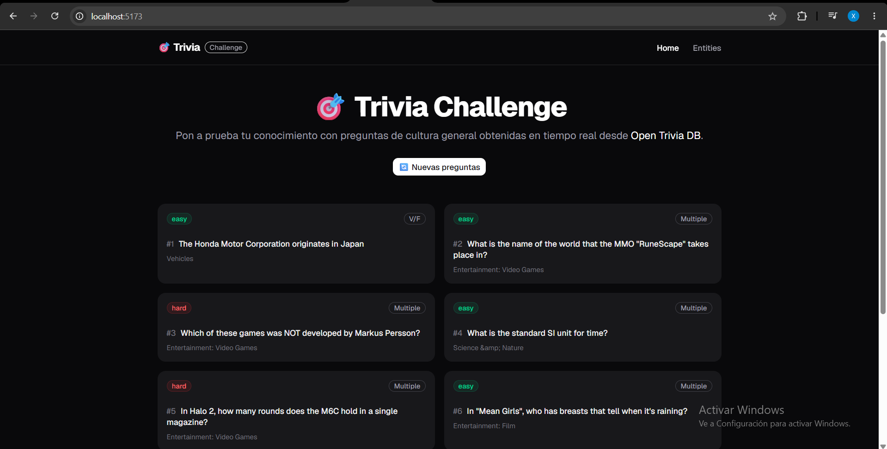
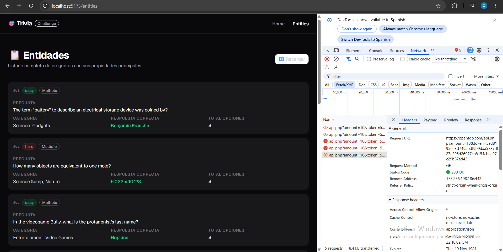
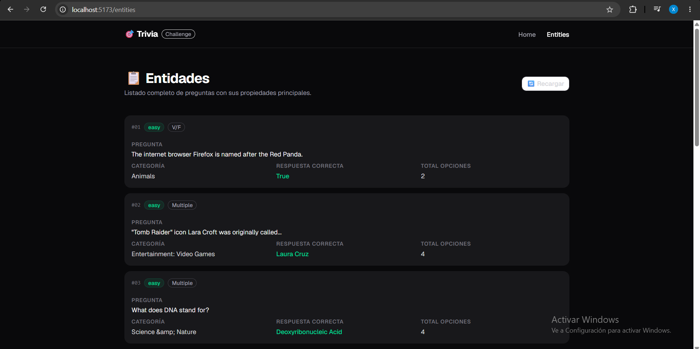
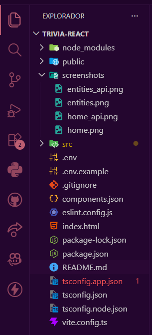

# 🎯 Trivia Challenge

> Aplicación de trivia en tiempo real construida con React 19 + Vite + TypeScript.

🚀 **[Ver demo en vivo](https://eva03-dawe.vercel.app)**

---

## 📸 Vista previa

### 🏠 Home



### 📋 Entities



---

## 🛠️ Tech Stack

| Tecnología | Versión |
|---|---|
| React + React Compiler | 19 / 1.0.0 |
| Vite | 8 |
| TypeScript | 5 |
| React Router | 7 |
| shadcn/ui + Tailwind CSS | 4 |

---

## 🚀 Getting Started

```bash
git clone https://github.com/tu-usuario/trivia-react.git
cd trivia-react
npm install
cp .env.example .env
npm run dev
```

---

## ⚙️ Variables de entorno

```
VITE_TRIVIA_TOKEN=tu_token_aqui
```

> Obtén tu token en: https://opentdb.com/api_token.php?command=request

---

## 📁 Project Structure

```
trivia-react/
├── src/
│   ├── components/
│   │   ├── ui/              # Card, Badge, Button (shadcn)
│   │   └── NavBar.tsx
│   ├── hooks/
│   │   └── useTrivia.ts     # Fetch + retry automático
│   ├── pages/
│   │   ├── Home.tsx         # Ruta "/"
│   │   └── Entities.tsx     # Ruta "/entities"
│   └── types/
│       └── trivia.ts
├── screenshots/
│   ├── home.png
│   └── entities.png
└── .env.example
```


---

## 🗺️ Routes

| Path | Descripción |
|---|---|
| `/` | Hero + grid de 10 preguntas |
| `/entities` | Listado detallado por entidad |

---

## 🌐 API

`GET https://opentdb.com/api.php?amount=10`

```json
{
  "response_code": 0,
  "results": [
    {
      "type": "multiple",
      "difficulty": "medium",
      "category": "Science & Nature",
      "question": "What is H2O?",
      "correct_answer": "Water",
      "incorrect_answers": ["Oxygen", "Hydrogen", "Carbon"]
    }
  ]
}
```

---

## 👤 Autor

**Diego Nina**  
Tecsup — Desarrollo de Aplicaciones WEB Empresariales